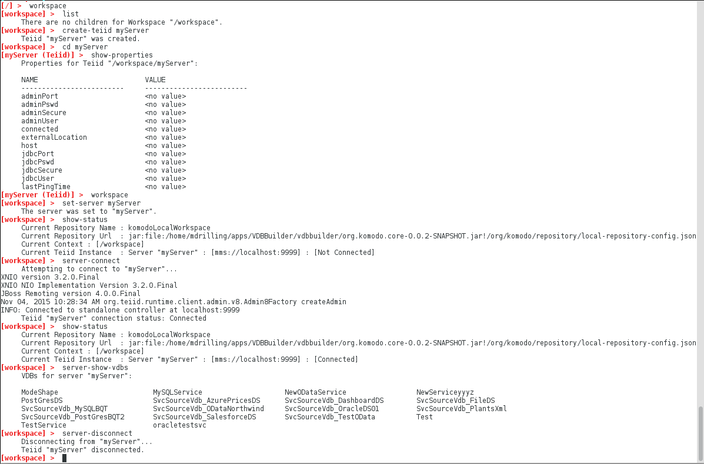

### Connect to a local Teiid Server

This sample shows how to connect to a teiid server instance using the VDB Builder cli.  This example also demonstrates how to view the datasources deployed to the server after you have successfully connected.

You can use __tab completion__ to see the available commands options, or use __help commandName__ to see command details.

### Requirements

* Install VDB Builder cli - refer to the [Installation Instructions](install-cli.md) for details

### Connect to a server

A default server is defined within the VDBBuilder cli.  You can specify the server connection properties, then connect to and interact with the server.  The sample session below shows how to connect to the server and view the deployed data sources.  Note that once you are connected to a server, many more server commands will become available.  You can discover the available server commands in VDBBuilder by typing 'help' after connecting to the server.

NOTE: VDBBuilder will attempt to connect to a server on startup if the global property SERVER_CONNECT_ON_STARTUP is set to true. 

---
Here is a summary of the commands used for the above session:

* __`show-status`__ - display the workspace status.  Note the current server status is [Not Connected]
* __`server-show-properties`__ - shows the default server properties.  You can use 'server-set-property' to change the properties.
* __`server-connect`__ - connects to the default server. 
* __`show-status`__ - display the status again.  This time, note the server status is [Connected]
* __`help`__ - shows the available commands.  Note the server commands that are now available.
* __`server-datasources`__ - display the datasources currently deployed on the connected server.
* __`server-disconnect`__ - disconnects from the default server.

---
