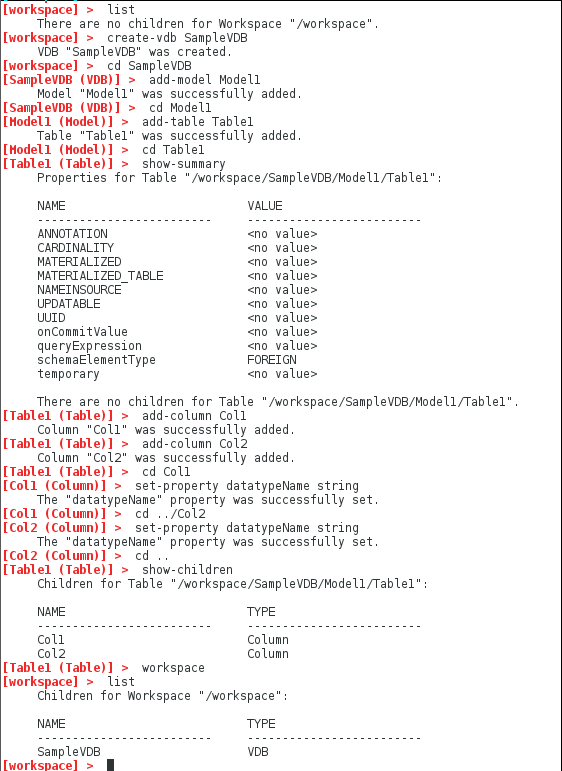

### Create a VDB interactively

This sample shows how to use the VDB Builder cli to create a new dynamic VDB interactively.  Use this sample as a starting point to create your own, more complex VDBS.

You can use __tab completion__ to see the available commands options, or use __help commandName__ to see command details.

### Requirements

* Install VDB Builder cli - refer to the [Installation Instructions](install-cli.md) for details

### Interactive VDB creation

Once you have launched the VDB Builder cli, it's easy to create a VDB.  The sample session below shows creation of a very simple VDB.

---
Here is a summary of the commands used for the above session:

* __`list`__ - shows all children at the cli context.  Our workspace initially contains no children.
* __`create-vdb SampleVDB`__ - create a VDB named __SampleVDB__
* __`cd SampleVDB`__ - 'navigates' down into the __SampleVDB__ 
* __`add-model Model1`__ - add a model named __Model1__ in the VDB
* __`cd Model1`__ - navigate into the Model1 cli context
* __`add-table Table1`__ - add a table named __Table1__ within Model1
* __`cd Table1`__ - navigate into the Table1 cli context
* __`show-summary`__ - shows a summary of the current cli context, in this case __Table1__.  Show summary will show the object properties, as well as its children.
* __`add-column Col1`__ - add column named __Col1__ within Table1
* __`add-column Col2`__ - add column named __Col2__ within Table1
* __`cd Col1`__ - navigates into column __Col1__
* __`set-property datatypeName string`__ sets __Col1__ datatype to __string__
* __`cd ../Col2`__ - navigates up a level, then down into column __Col2__
* __`set-property datatypeName string`__ sets __Col2__ datatype to __string__
* __`cd ..`__ - navigates up one level
* __`show-children`__ - show the children of the current context __Table1__.  Notice the child columns we created.
* __`workspace`__ - navigates to the __workspace__ root context.
* __`list`__ - list the workspace children - it now contains our __SampleVDB__!

---
