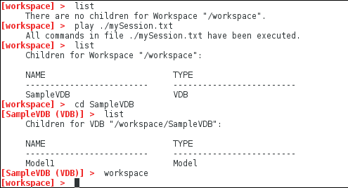
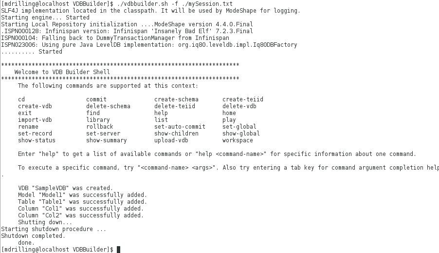

### Execute a command file

This sample shows how to use the VDB Builder cli to execute a previously saved session command file.  You can create or edit existing command files to fully script the construction of your VDBs!  Use this sample as a starting point for working with your own VDBS.

You can use __tab completion__ to see the available commands options, or use __help commandName__ to see command details.

### Requirements

* Install VDB Builder cli - refer to the [Installation Instructions](install-cli.md) for details

### Execute a command file

The image below shows the command file for this sample (mySession.txt).

---
To execute the command file, you have two options:

#### 1. Play file in interactive mode.  
Below is a session that shows the playback in interactive mode.  (remove the `exit` at end of script)

#### 2. Execute the file from command line 
You can execute the file from the VDB Builder launch command, using the __`-f`__ option, as shown below.  (Add `exit` at end of script file)

