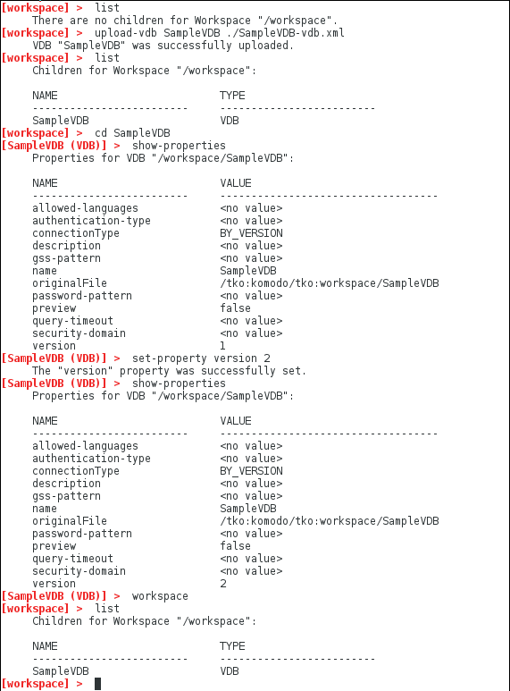

### Import and edit a VDB

This sample shows how to use the VDB Builder cli to import and edit a VDB interactively.  Use this sample as a starting point for working with your own VDBS.

You can use __tab completion__ to see the available commands options, or use __help commandName__ to see command details.

### Requirements

* Install VDB Builder cli - refer to the [Installation Instructions](install-cli.md) for details

### Import a VDB

The sample session below shows how to import your dynamic VDBs.  The session shows import of the __SampleVDB__ , and also shows an example of setting a VDB property - in this case, the VDB version.

---
Here is a summary of the commands used for the above session:

* __`list`__ - shows all children at the cli workspace context.  Our workspace initially contains no VDBs.
* __`upload-vdb SampleVDB ./SampleVDB-vdb.xml`__ - upload the VDB file __SampleVDB-vdb.xml__ located in the vdbbuilder folder.
* __`list`__ - list the workspace children again - it now contains our __SampleVDB__ VDB
* __`cd SampleVDB`__ - 'navigates' down into the __SampleVDB__ 
* __`show-properties`__ - shows the VDB properties
* __`set-property version 2`__ - sets the version to '2'
* __`show-properties`__ - shows the VDB properties again - notice the version is now '2'.
* __`workspace`__ - navigates to the __workspace__ root context.
* __`list`__ - list the workspace children

---

