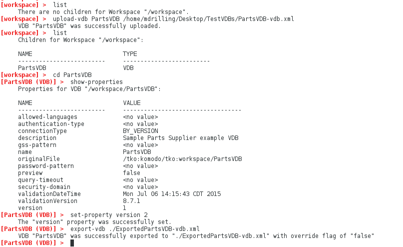
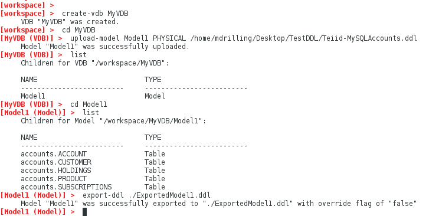

### Import and Export VDBs and DDL

These samples show how to use the VDB Builder cli to import and export VDBs and DDL interactively.  Use this sample as a starting point for working with your own VDBs and DDL.

You can use __tab completion__ to see the available commands options, or use __help commandName__ to see command details.


### Requirements

* Install VDB Builder cli - refer to the [Installation Instructions](install-cli.md) for details


### Import and Export VDBs

The sample session below shows how to import and export a dynamic VDB.  The session shows import of __PartsVDB-vdb.xml__ , set property to change the VDB version, then export of the VDB into a different dynamic VDB file.



---
```
upload-vdb <vdbName> <vdbFile>
``` 
upload VDB as name "vdbName" from "vdbFile" into the workspace

```
export-vdb <vdbFile>
```
export the current context VDB "PartsVDB" to the specified file "vdbFile"

---

### Import and Export DDL

The sample session below shows how to import and export DDL.  The session shows creation of a VDB with Model1, then import of __Teiid-MySQLAccounts.ddl__ to create the Model1 content, then export of the model contents into a different DDL file.



---
```
upload-model <modelName> <modelType> <ddlFile>
``` 
create a model "modelName" of "modelType", using the ddl in "ddlFile"

```
export-ddl <ddlFile>
```
export the current context "Model1" DDL to the specified file "ddlFile"

---


