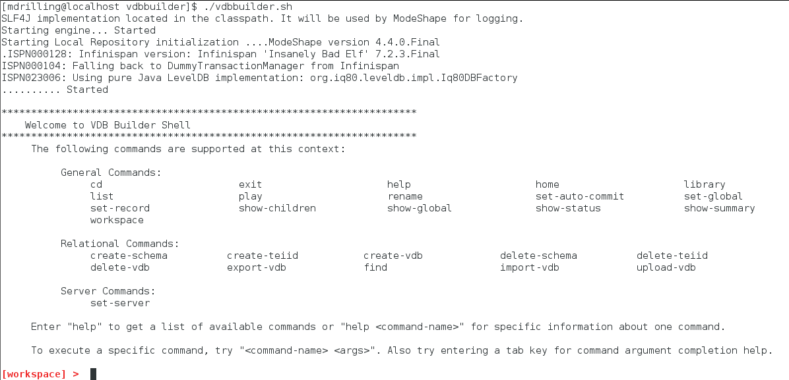

### Install VDB Builder

This article provides instructions for installing and launching the VDB Builder command line interface (cli).

### Installation options

To install the VDB Builder cli, you have two options:
1. Build latest source
2. Download a pre-built kit

### 1. Build latest source

To build a kit from the latest source:

1. Go to our [GitHub Repository](https://github.com/Teiid-Designer/komodo) 

2. Follow the github instructions to download and build the codebase.  After a successful build, the VDB Builder zip file __(vdbbuilder.build-*-vdbbuilder-console.zip)__ will be located under the **/build/target** directory.

3. Copy the VDB Builder zip file into a new folder on your file system, and extract it.

4. Open a terminal window at the install folder, then at the command prompt enter __`$ ./vdbbuilder.sh`__ - as shown below

### 2. Download a pre-build kit

A pre-built zip file is also available on sourceforge :

1. Download the [VDB Builder zip](http://sourceforge.net/projects/teiid/files/vdb-builder/0.x%20Releases/vdbbuilder-console-0.0.2-20150807.zip/download)

2. Copy the VDB Builder zip file into a folder on your file system and extract it.

3. Open a terminal window at the install folder, then at the command prompt enter __`$ ./vdbbuilder.sh`__ 

