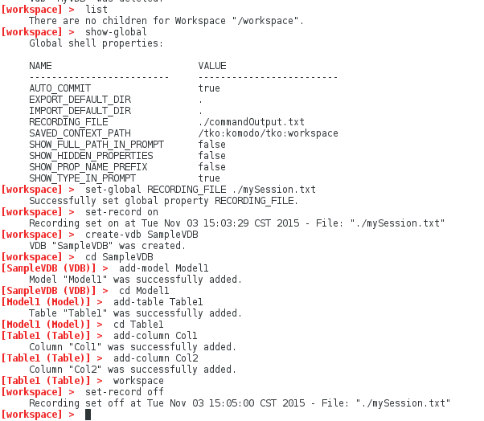
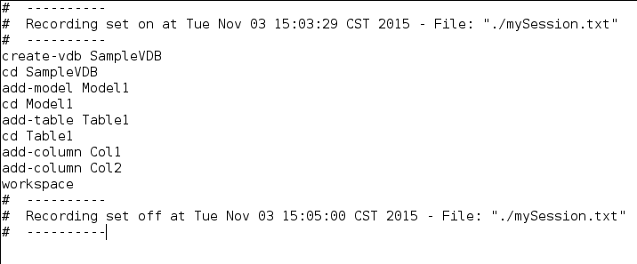

### Record session commands to a file

This sample shows how to use the VDB Builder cli to record your session commands for later playback.  You can use the command file to fully script the construction of your VDBs!  Use this sample as a starting point for working with your own VDBS.

You can use __tab completion__ to see the available commands options, or use __help commandName__ to see command details.

### Requirements

* Install VDB Builder cli - refer to the [Installation Instructions](install-cli.md) for details

### Record a session

The session below shows how to record session commands in VDB Builder.  The recording output is saved to a file specified in the VDB Builder global properties (RECORDING_FILE).  In the session below, our output is written to __./mySession.txt__

---
Here is a summary of the commands used for the above session:

* __`list`__ - shows all children at the cli workspace context.  Our workspace initially contains no VDBs.
* __`show-global`__ - shows the VDB Builder global constants.  One of the constants specifies the recording output file (RECORDING_FILE)
* __`set-global RECORDING_FILE ./mySession.txt`__ - changes the file where our session commands will be saved.
* __`set-record on`__ - starts 'recording' all subsequent commands 
* __`create-vdb SampleVDB`__ - create vdb __SampleVDB__ 
* __`cd SampleVDB`__ - 'navigates' down into __SampleVDB__ 
* __`add-model Model1`__ - add model __Model1__ 
* __`cd Model1`__ - 'navigates' down into __Model1__ 
* __`add-table Table1`__ - add table __Table1__ 
* __`cd Table1`__ - 'navigates' down into __Table1__ 
* __`add-column Col1`__ - add column __Col1__ 
* __`add-column Col2`__ - add column __Col2__ 
* __`workspace`__ - navigates to the __workspace__ context.
* __`set-record off`__ - stop recording commands 

---

The image below shows what our recording file (mySession.txt) looks like.  (I have commented out the `set-record on` line)

